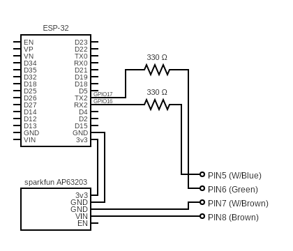
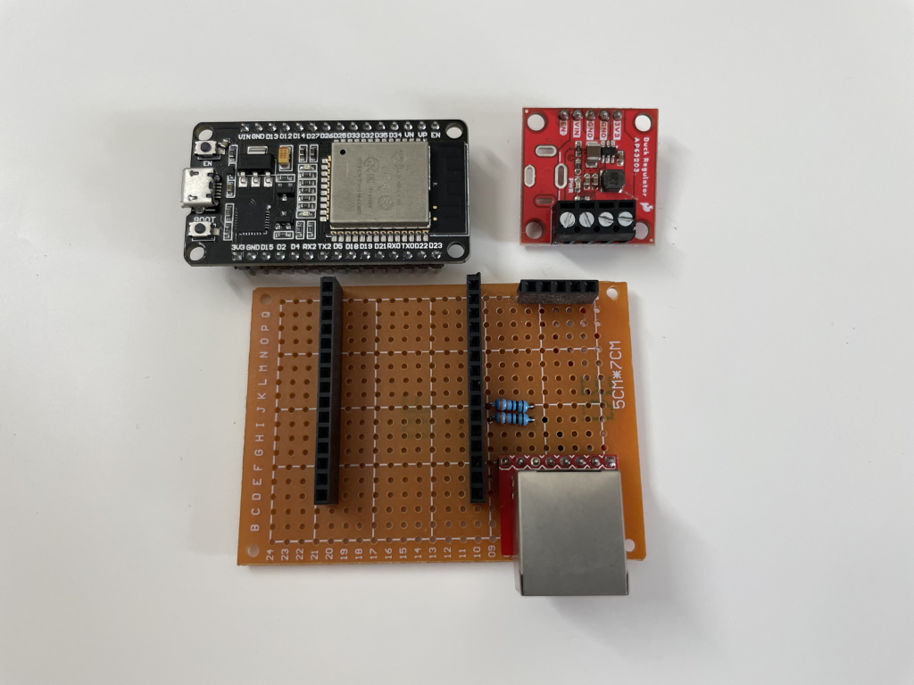
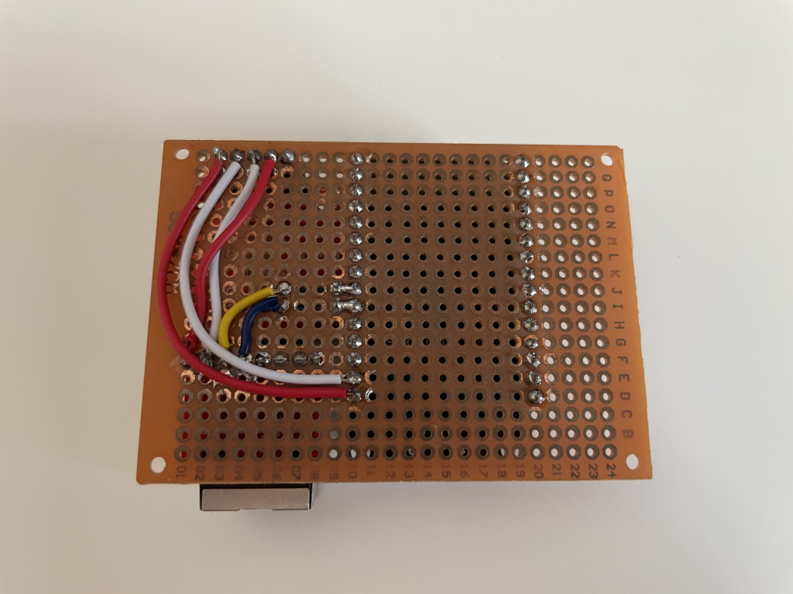
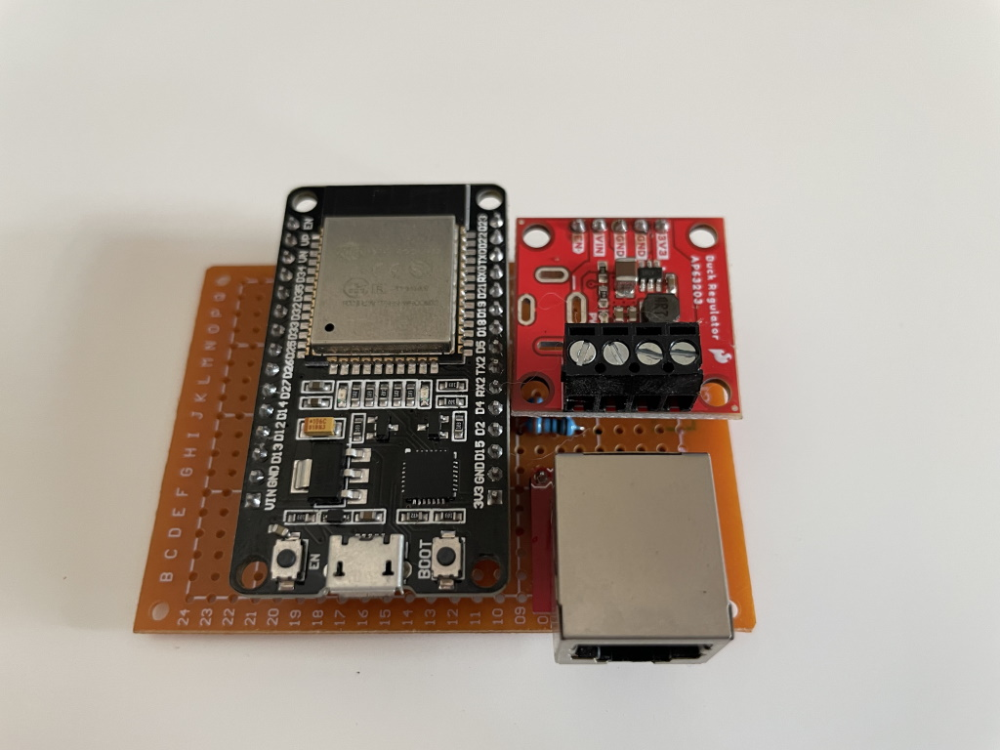
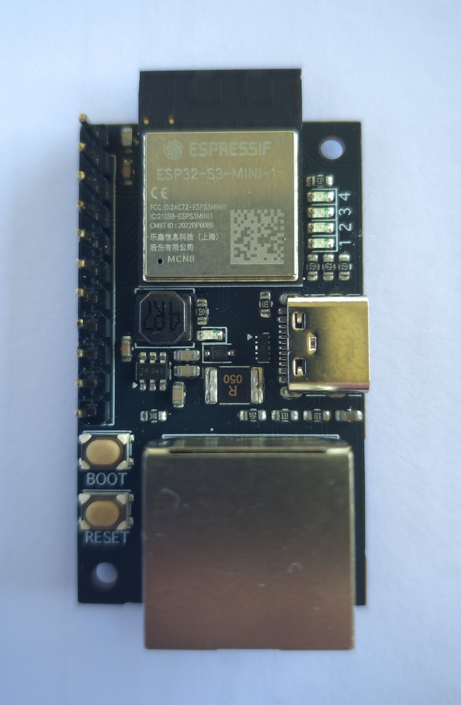

# Hardware

The eSpa project to date focuses on adding home automation support to SpaNet-branded pool controllers. The [firmware](/firmware) is designed to run on the ESP32 microcontroller, which is a popular choice for IoT projects due to its built-in WiFi and Bluetooth capabilities. This page will cover how to build your own hardware to connect to your spa pool, and also how to [buy a pre-built eSpa PCB](#buying-a-pre-built-pcb) to save you the trouble.

## Spa Pool Connection Overview

On spa pools containing SpaNet SV and SV Mini controllers, there exists a port labeled `EXP1` or `EXPAND1` port. This is a standard RJ-45 plug, with the following output coming from the controller on each of the pins:

| Pin | Controller | WiFly Adapter       |
|-----|------------|---------------------|
| 1   | Health Led | Pass through        |
| 2   | GND        | Pass through        |
| 3   | Not used   |                     |
| 4   | Not used   |                     |
| 5   | TX         | RX                  |
| 6   | RX         | TX                  |
| 7   | GND        | GND                 |
| 8   | 12V        | 12V                 |

Because the spa is outputting 12V over this connection, we can build our controller with no need for an external power connection - all we need to do is convert the 12V down to a 3.3V voltage suitable for our ESP32 chip. We then use pins 5/6 to communicate with the controller, using our [custom firmware](/firmware).

## Building Your Own Hardware

::: danger 
It is really important to note that shorting pins 7 and 8 on the `EXP1` port will cause the spa controller to short, and cause irreparable damage to the controller. This is why it is important to build your own hardware with care, and to test it thoroughly before connecting it to your spa pool. We've already heard of at least two people who have had to replace their spa controllers due to this mistake.
:::

### Components

The table below lists a few options for purchasing the required components. [AliExpress](https://aliexpress.com) is typically cheaper but has a much slower delivery, compared with the more expensive [Core Electronics](https://core-electronics.com.au/) (based in Australia), with their faster delivery times.

| Component        | Store links | Comments |
|------------------|-------------|----------|
| ESP32            | [AliExpress](https://www.aliexpress.com/item/1005001929935550.html?spm=a2g0o.order_list.0.0.74be1802hFqod2) / [Core](https://core-electronics.com.au/firebeetle-esp32-e-iot-microcontroller-with-header-supports-wi-fi-bluetooth.html) | Get 1 already-wielded ESP32. |
| RJ45 connector   | [AliExpress](https://www.aliexpress.com/item/1005003717285471.html?spm=a2g0o.order_list.0.0.74be1802hFqod2) / [Core](https://core-electronics.com.au/sparkfun-rj45-magjack-breakout.html) | Get a 'H Type+DIP Pins'. |
| Buck converter   | [AliExpress](https://www.aliexpress.com/item/1005002603013499.html?spm=a2g0o.order_list.0.0.74be1802hFqod2) / [Core](https://core-electronics.com.au/sparkfun-babybuck-regulator-breakout-3-3v-ap63203.html) | Get a '5-40V to 3.3V' converter. |
| 330 ohm Resistor | [AliExpress](https://www.aliexpress.com/item/32952657927.html?spm=a2g0o.order_list.0.0.74be1802hFqod2) / [Core](https://core-electronics.com.au/resistor-330-ohm-1-6th-watt-pth.html) | You need two 330 ohm resistors. |

Beyond these key components, you may want to buy some protoboards, breadboards, pin headers, cables, etc to build your device. Some useful links include:

| Component | Store links | Comments |
|-----------|-------------|----------|
| Pin Headers | [AliExpress](https://www.aliexpress.com/item/32724478308.html?spm=a2g0o.order_list.0.0.74be1802hFqod2) | |
| Perfboard | [AliExpress](https://www.aliexpress.com/item/1005003422520490.html?spm=a2g0o.order_list.0.0.74be1802hFqod2) | If you want to solder your hardware together. |

### Assembly Images

To keep things as simple as possible, off the shelf modules have been used.
NOTE: The resitors on the RX/TX pins are recommended but optional.

## Buying a Pre-Built PCB

If building your own hardware is not your thing, you can [purchase a pre-built eSpa PCB online](https://store.jonathangiles.net). This PCB is designed to be a drop-in solution for people wanting to add their spa pool to their home automation systems, and comes with all the required components already soldered in place.

